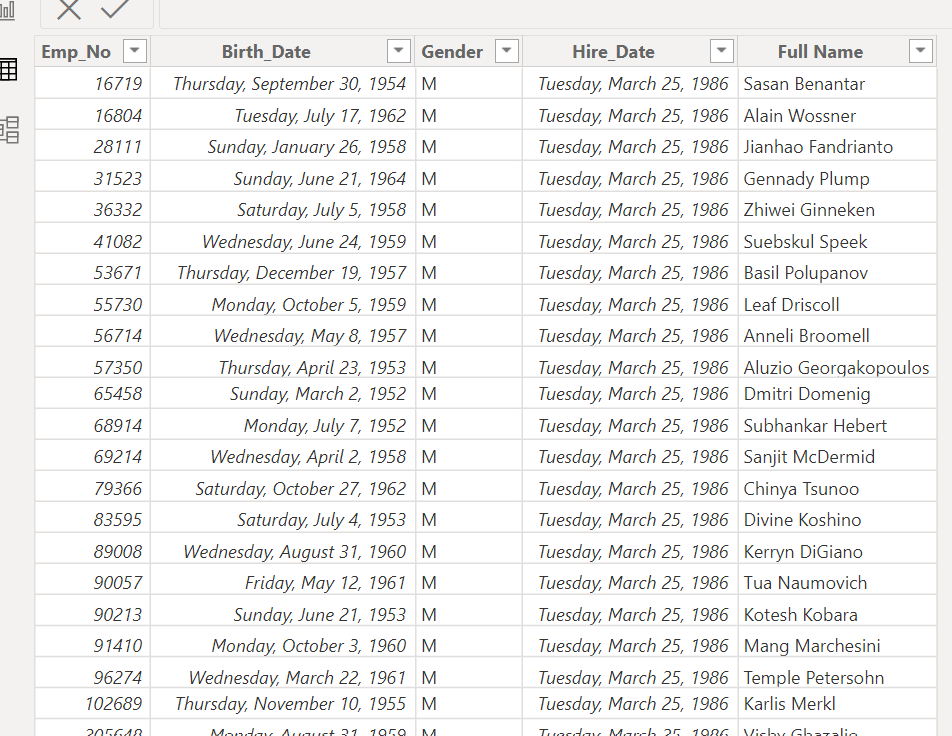

### Data Cleaning and Transformation

#### Introduction: 

One of the most important but crucial steps in data management is data cleaning. The maintenance of accuracy and reliability is one of the primary parts of data cleaning.
In this task, a large dataset was given to clean and transform. This will enable quality insights for decision-making.

The screenshot shows cleaned and transformed data. The steps carried out in cleaning and transforming the data were;

1. Check Title Case: Ensure that the "Title" column uses proper case, which means capitalizing the first letter of each word.

2. Assess Data Quality: Assessing the quality of the data involves checking for errors, inconsistencies, and missing values using the column profile to determine errors. 

3. Spellcheck: Search for and correct any misspelled words in the dataset. This step is crucial for maintaining data accuracy and reliability.

4. Merge or Delete Columns: Evaluate if there are any redundant or unnecessary columns in the dataset. Decide whether to merge certain columns or eliminate ones that don't contribute to the analysis.

#### Conclusion:
The ultimate objective of data cleaning is to achieve a dataset that is not only accurate but also consistent. This task serves as a valuable learning experience, highlighting the significance of data cleaning and transformation.

By successfully implementing data cleaning steps, the result is a dataset that can provide meaningful insights crucial for informed decision-making and analysis.
